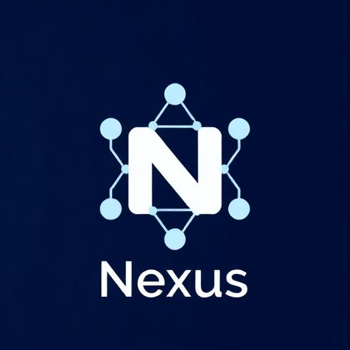

<p align="center">
  
</p>

<h1 align="center">Nexus AI OS</h1>

<p align="center">
  <strong>Enterprise AI-Powered Project Management Operating System</strong>
</p>

<p align="center">
  <a href="#features">Features</a> •
  <a href="#quick-start">Quick Start</a> •
  <a href="#tech-stack">Tech Stack</a> •
  <a href="#deployment">Deployment</a> •
  <a href="#documentation">Documentation</a>
</p>

<p align="center">
  
  
  
  
  
</p>

---

## Overview

**Nexus AI OS** is a comprehensive, enterprise-grade project management platform designed for PMO (Project Management Office) teams. It combines traditional project management capabilities with cutting-edge AI features to streamline decision-making, automate reporting, and provide predictive insights across your project portfolio.

### Key Value Propositions

- 🎯 **Unified Command Center** — Single dashboard for all project activities, decisions, and stakeholder communications
- 🤖 **AI-First Architecture** — Integrated AI assistant, automated reports, risk prediction, and smart task suggestions
- 🔐 **Enterprise Security** — Role-based access control (RBAC), row-level security (RLS), and comprehensive audit logging
- 🌐 **Multi-Tenant Ready** — Configurable tenant settings, white-label branding, and customizable templates

---

## Features

### Core Modules

| Module | Description |
|--------|-------------|
| **Dashboard** | Real-time KPIs, portfolio health, budget tracking, and velocity charts |
| **Projects** | Project lifecycle management with team assignments and milestones |
| **Tasks** | Kanban board with drag-and-drop, smart task suggestions |
| **Smart Inbox** | AI-prioritized communications with sentiment analysis |
| **Decisions** | Structured decision logging with audit trail and stakeholder tracking |
| **Calendar** | Integrated scheduling with meeting hub |
| **Documents** | Knowledge base with full-text search |
| **Reports** | AI-generated reports with export capabilities |

### AI Capabilities

| Feature | Description |
|---------|-------------|
| **AI Chat Assistant** | Context-aware project assistant for queries and guidance |
| **Risk Prediction** | ML-powered risk assessment with mitigation suggestions |
| **Smart Digest** | Weekly AI-generated project summaries |
| **Auto-Replies** | AI-suggested email responses |
| **Task Suggestions** | Intelligent task recommendations based on project context |
| **Explainability** | "Why am I seeing this?" transparency for all AI outputs |

### Security & Governance

- **8 Role Levels**: Admin, Tenant Admin, Executive, PMO, Program Manager, Senior PM, Project Manager, User
- **Row-Level Security**: Database-enforced data isolation
- **Audit Logging**: Complete trail for decisions and AI outputs
- **Role Request Workflow**: Formal approval process for role escalation

---

## Tech Stack

### Frontend
- **React 18** — UI library with hooks and concurrent features
- **TypeScript** — Type-safe development
- **Vite** — Lightning-fast build tool
- **Tailwind CSS** — Utility-first styling
- **shadcn/ui** — Accessible component library
- **Recharts** — Data visualization
- **React Router** — Client-side routing
- **TanStack Query** — Server state management

### Backend (Lovable Cloud / Azure)
- **PostgreSQL** — Primary database
- **Edge Functions** — Serverless API endpoints
- **Row-Level Security** — Database-enforced access control
- **Real-time Subscriptions** — Live data updates

### AI Integration
- **Lovable AI** — Built-in AI capabilities (Gemini, GPT models)
- **Azure OpenAI** — Enterprise AI deployment option

### Infrastructure
- **Azure Static Web Apps** — Frontend hosting
- **Azure Functions** — Serverless compute
- **Azure PostgreSQL** — Managed database
- **Azure CDN** — Global content delivery
- **GitHub Actions** — CI/CD pipelines

---

## Quick Start

### Prerequisites

- Node.js 18+ 
- npm or bun package manager

### Installation

```bash
# Clone the repository
git clone https://github.com/your-org/nexus-ai-os.git

# Navigate to project directory
cd nexus-ai-os

# Install dependencies
npm install
# or
bun install

# Start development server
npm run dev
# or
bun dev
```

The application will be available at `http://localhost:5173`

### Environment Variables

Create a `.env` file in the project root:

```env
VITE_SUPABASE_URL=your_supabase_url
VITE_SUPABASE_PUBLISHABLE_KEY=your_anon_key
```

> **Note**: When using Lovable Cloud, environment variables are automatically configured.

---

## Project Structure

```
nexus-ai-os/
├── .github/
│   └── workflows/          # CI/CD pipeline definitions
│       ├── ci.yml          # Continuous integration
│       ├── deploy-dev.yml  # Development deployment
│       ├── deploy-staging.yml
│       ├── deploy-prod.yml
│       └── rollback.yml    # Emergency rollback
│
├── infrastructure/
│   └── azure/              # Azure Bicep templates
│       ├── main.bicep      # Main infrastructure
│       ├── modules/        # Reusable modules
│       ├── parameters/     # Environment configs
│       └── database/       # Migration scripts
│
├── public/
│   └── docs/               # Static documentation
│
├── src/
│   ├── assets/             # Images and static files
│   ├── components/
│   │   ├── ui/             # shadcn/ui components
│   │   ├── dashboard/      # Dashboard widgets
│   │   ├── ai/             # AI-related components
│   │   ├── admin/          # Admin panel components
│   │   └── ...             # Feature components
│   ├── hooks/              # Custom React hooks
│   ├── integrations/       # External service clients
│   ├── lib/                # Utility functions
│   ├── pages/              # Route components
│   └── data/               # Mock data (development)
│
├── supabase/
│   ├── config.toml         # Supabase configuration
│   └── functions/          # Edge functions
│       ├── ai-chat/
│       ├── generate-report/
│       ├── suggest-tasks/
│       └── ...
│
└── package.json
```

---

## Deployment

### Option 1: Lovable Cloud (Recommended)

1. Open your project in [Lovable](https://lovable.dev)
2. Click **Publish** → **Update**
3. Your app is live! 🎉

### Option 2: Azure Deployment

#### Prerequisites
- Azure CLI installed and authenticated
- GitHub repository connected

#### Deploy Infrastructure

```bash
# Navigate to infrastructure directory
cd infrastructure/azure

# Deploy to development
./scripts/deploy.sh dev

# Deploy to staging
./scripts/deploy.sh staging

# Deploy to production
./scripts/deploy.sh prod
```

#### CI/CD Pipeline

The project includes GitHub Actions workflows for automated deployment:

| Workflow | Trigger | Environment |
|----------|---------|-------------|
| `ci.yml` | PR / Push to main | — |
| `deploy-dev.yml` | Push to `develop` | Development |
| `deploy-staging.yml` | Push to `main` | Staging |
| `deploy-prod.yml` | GitHub Release | Production |

#### Required GitHub Secrets

```
# Azure Authentication
AZURE_SUBSCRIPTION_ID
AZURE_TENANT_ID
AZURE_CLIENT_ID
AZURE_CLIENT_SECRET

# Static Web Apps
AZURE_STATIC_WEB_APPS_API_TOKEN_DEV
AZURE_STATIC_WEB_APPS_API_TOKEN_STAGING
AZURE_STATIC_WEB_APPS_API_TOKEN_PROD

# Database
DB_CONNECTION_STRING_DEV
DB_CONNECTION_STRING_STAGING
DB_CONNECTION_STRING_PROD

# Application
VITE_SUPABASE_URL
VITE_SUPABASE_PUBLISHABLE_KEY
```

---

## Database Schema

### Core Tables

| Table | Purpose |
|-------|---------|
| `profiles` | User profile information |
| `user_roles` | Role assignments (RBAC) |
| `role_definitions` | Role metadata and permissions |
| `decisions` | Decision log entries |
| `documents` | Knowledge base content |
| `user_activities` | Activity tracking |

### Audit Tables

| Table | Purpose |
|-------|---------|
| `decision_audit_logs` | Decision change history |
| `ai_output_audit_logs` | AI generation tracking |

### Configuration Tables

| Table | Purpose |
|-------|---------|
| `tenant_settings` | Multi-tenant configuration |
| `company_branding` | White-label settings |
| `document_templates` | Report templates |
| `email_templates` | Communication templates |

---

## API Reference

### Edge Functions

| Endpoint | Method | Description |
|----------|--------|-------------|
| `/ai-chat` | POST | AI chat completion |
| `/generate-report` | POST | Generate AI report |
| `/suggest-tasks` | POST | Get task suggestions |
| `/generate-risk-mitigation` | POST | Risk analysis |
| `/generate-weekly-digest` | POST | Weekly summary |
| `/rag-query` | POST | Document Q&A |

### Authentication

The platform uses Supabase Auth with support for:
- Email/Password authentication
- Magic link sign-in
- OAuth providers (configurable)

---

## Role Hierarchy

```
Admin (Level 100)
  └── Tenant Admin (Level 90)
        └── Executive (Level 80)
              └── PMO (Level 70)
                    └── Program Manager (Level 60)
                          └── Senior Project Manager (Level 50)
                                └── Project Manager (Level 40)
                                      └── User (Level 10)
```

---

## Contributing

### Development Workflow

1. Fork the repository
2. Create a feature branch: `git checkout -b feature/amazing-feature`
3. Make your changes
4. Run linting: `npm run lint`
5. Run type checking: `npm run typecheck`
6. Commit: `git commit -m 'Add amazing feature'`
7. Push: `git push origin feature/amazing-feature`
8. Open a Pull Request

### Branch Naming

- `feature/` — New features
- `fix/` — Bug fixes
- `refactor/` — Code improvements
- `docs/` — Documentation updates

### Code Style

- ESLint configuration enforced
- Prettier for formatting
- TypeScript strict mode enabled

---

## Documentation

- [Azure Migration Guide](public/docs/Azure-Migration-Guide.md)
- [Product Details](public/docs/Nexus-Project-OS-Product-Details.md)
- [CI/CD Pipeline](.github/workflows/README.md)

---

## License

This project is licensed under the MIT License — see the [LICENSE](LICENSE) file for details.

---

## Support

- 📧 Email: support@nexus-os.com
- 💬 Discord: [Join our community](https://discord.gg/nexus-os)
- 📚 Docs: [docs.nexus-os.com](https://docs.nexus-os.com)

---

<p align="center">
  Built with ❤️ using <a href="https://lovable.dev">Lovable</a>
</p>
