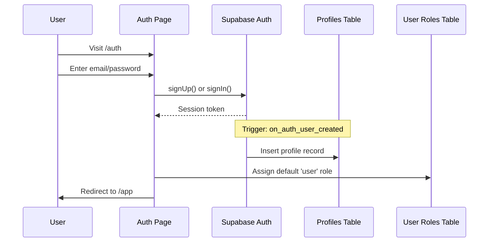
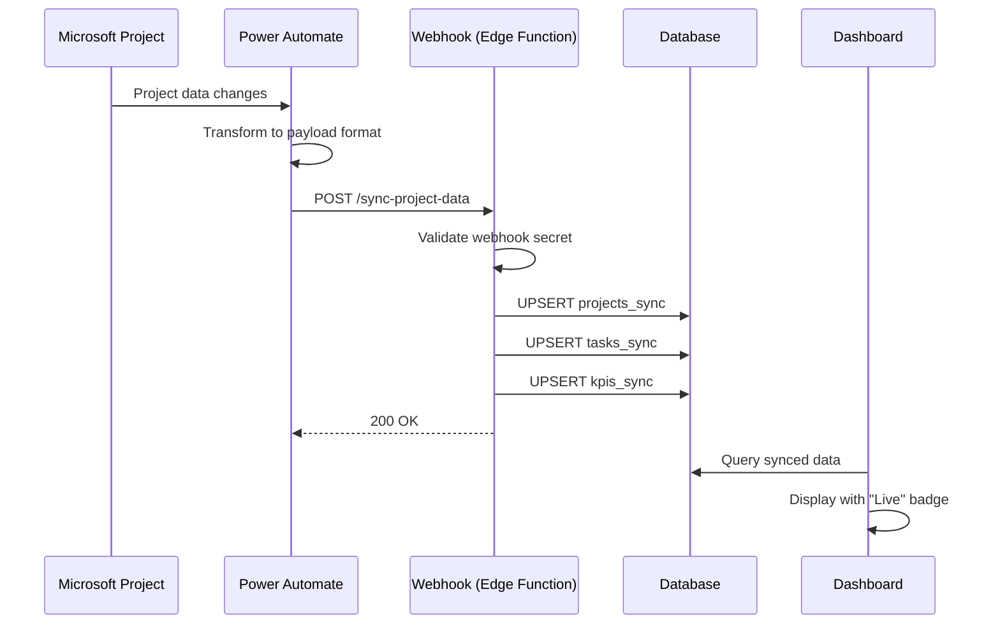
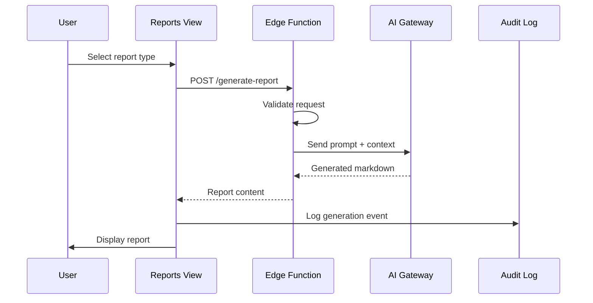

# Masira Project Blueprint

## Complete Documentation for Project Replication

This blueprint provides a comprehensive technical specification of the Masira application, enabling replication in any development environment or framework.

---

## 1. Project Overview

**Application Name:** Masira (formerly Nexus Project OS)  
**Type:** Enterprise Project Management & AI-Powered Intelligence Platform  
**Architecture:** React SPA with Backend-as-a-Service (Supabase)

### Core Capabilities
- Role-based project management dashboard
- AI-powered task suggestions and report generation
- Real-time collaboration and presence
- Microsoft Project data synchronization
- Multi-tenant configuration
- Executive and operational dashboards

---

## 2. Technology Stack

### Frontend
| Technology | Version | Purpose |
|------------|---------|---------|
| React | ^18.3.1 | UI Framework |
| Vite | ^5.4.19 | Build Tool |
| TypeScript | ^5.8.3 | Type Safety |
| Tailwind CSS | ^3.4.17 | Styling |
| React Router DOM | ^6.30.1 | Routing |
| TanStack React Query | ^5.83.0 | Server State |
| Recharts | ^2.15.4 | Data Visualization |
| Lucide React | ^0.462.0 | Icons |
| React Hook Form | ^7.61.1 | Form Handling |
| Zod | ^3.25.76 | Validation |
| date-fns | ^3.6.0 | Date Utilities |

### UI Components (Radix UI Primitives)
- accordion, alert-dialog, avatar, checkbox, collapsible
- context-menu, dialog, dropdown-menu, hover-card
- label, menubar, navigation-menu, popover, progress
- radio-group, scroll-area, select, separator, sheet
- slider, switch, tabs, toast, toggle, tooltip

### Backend (Supabase/Lovable Cloud)
- PostgreSQL Database with RLS
- Edge Functions (Deno runtime)
- Authentication (Email/Password, OAuth)
- Storage Buckets
- Realtime Subscriptions

---

## 3. Project Structure

```
masira/
├── public/
│   ├── docs/                    # Documentation files
│   ├── favicon.ico
│   └── robots.txt
├── src/
│   ├── assets/                  # Static assets (images, logos)
│   │   ├── inbox/              # Avatar images for inbox
│   │   ├── projects/           # Project member avatars
│   │   ├── stakeholders/       # Stakeholder avatars
│   │   ├── team/               # Team member avatars
│   │   └── masira-logo.ico     # Application logo
│   ├── components/
│   │   ├── activity/           # Activity tracking views
│   │   ├── admin/              # Admin management components
│   │   ├── ai/                 # AI controls and explainability
│   │   ├── auth/               # Protected route components
│   │   ├── branding/           # White-label branding
│   │   ├── calendar/           # Calendar view
│   │   ├── chat/               # AI chat interface
│   │   ├── collaboration/      # Real-time collaboration
│   │   ├── dashboard/          # Dashboard widgets
│   │   ├── decisions/          # Decision log
│   │   ├── digest/             # Weekly digest
│   │   ├── docs/               # Documentation layout
│   │   ├── documents/          # Document management
│   │   ├── inbox/              # Smart inbox
│   │   ├── knowledge/          # Knowledge base
│   │   ├── landing/            # Landing page components
│   │   ├── layout/             # Header, Sidebar
│   │   ├── meetings/           # Meeting hub
│   │   ├── notifications/      # Notification system
│   │   ├── projects/           # Project views
│   │   ├── reports/            # Report generation
│   │   ├── risk/               # Risk prediction
│   │   ├── settings/           # Settings forms
│   │   ├── stakeholders/       # Stakeholder management
│   │   ├── strategy/           # Strategy view
│   │   ├── tasks/              # Task board (Kanban)
│   │   ├── team/               # Team management
│   │   └── ui/                 # 49 shadcn/ui components
│   ├── data/
│   │   └── mockData.ts         # Sample data
│   ├── hooks/
│   │   ├── use-mobile.tsx      # Mobile detection
│   │   ├── use-toast.ts        # Toast notifications
│   │   ├── useActivityTracking.tsx
│   │   ├── useAdminRole.tsx
│   │   ├── useAuditLog.tsx
│   │   ├── useAuth.tsx         # Authentication context
│   │   ├── useDynamicPermissions.tsx
│   │   ├── useLanguage.tsx     # i18n/RTL support
│   │   ├── usePresence.tsx     # Real-time presence
│   │   ├── useRealtimeActivity.tsx
│   │   ├── useSyncedData.tsx   # External data sync
│   │   ├── useTenantSettings.tsx
│   │   └── useUserRole.tsx     # Role-based access
│   ├── integrations/
│   │   └── supabase/
│   │       ├── client.ts       # Auto-generated client
│   │       └── types.ts        # Auto-generated types
│   ├── lib/
│   │   ├── permissions.ts      # RBAC configuration
│   │   └── utils.ts            # Utility functions
│   ├── pages/
│   │   ├── docs/               # Documentation pages
│   │   ├── AdminAnalytics.tsx
│   │   ├── Auth.tsx            # Login/Signup
│   │   ├── FeaturesShowcase.tsx
│   │   ├── Index.tsx           # Main app shell
│   │   ├── Landing.tsx         # Public landing
│   │   ├── NotFound.tsx
│   │   ├── PitchDeck.tsx
│   │   ├── ProductDemo.tsx
│   │   └── Settings.tsx
│   ├── App.tsx                 # Root component with routing
│   ├── index.css               # Global styles & CSS variables
│   └── main.tsx                # Entry point
├── supabase/
│   ├── functions/              # Edge Functions
│   │   ├── ai-chat/
│   │   ├── create-test-users/
│   │   ├── generate-ai-explanation/
│   │   ├── generate-ai-reply/
│   │   ├── generate-report/
│   │   ├── generate-risk-mitigation/
│   │   ├── generate-weekly-digest/
│   │   ├── rag-query/
│   │   ├── suggest-tasks/
│   │   └── sync-project-data/
│   └── config.toml
├── infrastructure/
│   └── azure/                  # Azure deployment (Bicep)
├── tailwind.config.ts
├── vite.config.ts
├── tsconfig.json
└── package.json
```

---

## 4. Database Schema

### Custom Types

```sql
CREATE TYPE app_role AS ENUM (
  'user',
  'project_manager',
  'senior_project_manager',
  'program_manager',
  'executive',
  'pmo',
  'tenant_admin',
  'admin'
);
```

### Tables (14 total)

#### profiles
```sql
CREATE TABLE profiles (
  id UUID PRIMARY KEY DEFAULT gen_random_uuid(),
  user_id UUID NOT NULL UNIQUE,
  display_name TEXT,
  avatar_url TEXT,
  created_at TIMESTAMPTZ DEFAULT now(),
  updated_at TIMESTAMPTZ DEFAULT now()
);
```

#### user_roles
```sql
CREATE TABLE user_roles (
  id UUID PRIMARY KEY DEFAULT gen_random_uuid(),
  user_id UUID NOT NULL,
  role app_role DEFAULT 'user',
  created_at TIMESTAMPTZ DEFAULT now()
);
```

#### role_definitions
```sql
CREATE TABLE role_definitions (
  id UUID PRIMARY KEY DEFAULT gen_random_uuid(),
  role app_role NOT NULL,
  display_name TEXT NOT NULL,
  description TEXT NOT NULL,
  hierarchy_level INTEGER DEFAULT 0,
  permissions JSONB DEFAULT '[]',
  created_at TIMESTAMPTZ DEFAULT now(),
  updated_at TIMESTAMPTZ DEFAULT now()
);
```

#### role_requests
```sql
CREATE TABLE role_requests (
  id UUID PRIMARY KEY DEFAULT gen_random_uuid(),
  user_id UUID NOT NULL,
  requested_role TEXT NOT NULL,
  status TEXT DEFAULT 'pending',
  admin_notes TEXT,
  reviewed_at TIMESTAMPTZ,
  reviewed_by UUID,
  created_at TIMESTAMPTZ DEFAULT now(),
  updated_at TIMESTAMPTZ DEFAULT now()
);
```

#### decisions
```sql
CREATE TABLE decisions (
  id UUID PRIMARY KEY DEFAULT gen_random_uuid(),
  user_id UUID NOT NULL,
  title TEXT NOT NULL,
  description TEXT,
  decision_type TEXT DEFAULT 'strategic',
  status TEXT DEFAULT 'pending',
  priority TEXT DEFAULT 'medium',
  project_name TEXT,
  amount TEXT,
  rationale TEXT,
  impact TEXT,
  stakeholders TEXT[],
  due_date TIMESTAMPTZ,
  decided_at TIMESTAMPTZ,
  decided_by UUID,
  created_at TIMESTAMPTZ DEFAULT now(),
  updated_at TIMESTAMPTZ DEFAULT now()
);
```

#### decision_audit_logs
```sql
CREATE TABLE decision_audit_logs (
  id UUID PRIMARY KEY DEFAULT gen_random_uuid(),
  decision_id UUID NOT NULL REFERENCES decisions(id),
  user_id UUID NOT NULL,
  action TEXT NOT NULL,
  previous_status TEXT,
  new_status TEXT,
  notes TEXT,
  created_at TIMESTAMPTZ DEFAULT now()
);
```

#### documents
```sql
CREATE TABLE documents (
  id UUID PRIMARY KEY DEFAULT gen_random_uuid(),
  user_id UUID NOT NULL,
  title TEXT NOT NULL,
  content TEXT NOT NULL,
  file_name TEXT,
  file_type TEXT,
  search_vector TSVECTOR,
  created_at TIMESTAMPTZ DEFAULT now(),
  updated_at TIMESTAMPTZ DEFAULT now()
);
```

#### document_templates
```sql
CREATE TABLE document_templates (
  id UUID PRIMARY KEY DEFAULT gen_random_uuid(),
  user_id UUID NOT NULL,
  name TEXT NOT NULL,
  type TEXT NOT NULL,
  content TEXT NOT NULL,
  is_default BOOLEAN DEFAULT false,
  created_at TIMESTAMPTZ DEFAULT now(),
  updated_at TIMESTAMPTZ DEFAULT now()
);
```

#### email_templates
```sql
CREATE TABLE email_templates (
  id UUID PRIMARY KEY DEFAULT gen_random_uuid(),
  user_id UUID NOT NULL,
  name TEXT NOT NULL,
  type TEXT NOT NULL,
  subject TEXT NOT NULL,
  body TEXT NOT NULL,
  is_default BOOLEAN DEFAULT false,
  created_at TIMESTAMPTZ DEFAULT now(),
  updated_at TIMESTAMPTZ DEFAULT now()
);
```

#### projects_sync
```sql
CREATE TABLE projects_sync (
  id UUID PRIMARY KEY DEFAULT gen_random_uuid(),
  external_id TEXT NOT NULL,
  source TEXT DEFAULT 'microsoft_project',
  name TEXT NOT NULL,
  description TEXT,
  health TEXT DEFAULT 'on-track',
  progress INTEGER DEFAULT 0,
  budget NUMERIC DEFAULT 0,
  spent NUMERIC DEFAULT 0,
  start_date TIMESTAMPTZ,
  end_date TIMESTAMPTZ,
  priority TEXT DEFAULT 'medium',
  category TEXT,
  team_data JSONB DEFAULT '[]',
  milestones_data JSONB DEFAULT '[]',
  raw_data JSONB DEFAULT '{}',
  created_at TIMESTAMPTZ DEFAULT now(),
  updated_at TIMESTAMPTZ DEFAULT now(),
  UNIQUE(external_id, source)
);
```

#### tasks_sync
```sql
CREATE TABLE tasks_sync (
  id UUID PRIMARY KEY DEFAULT gen_random_uuid(),
  external_id TEXT NOT NULL,
  source TEXT DEFAULT 'microsoft_project',
  project_external_id TEXT,
  title TEXT NOT NULL,
  description TEXT,
  status TEXT DEFAULT 'todo',
  priority TEXT DEFAULT 'medium',
  assignee TEXT,
  due_date TIMESTAMPTZ,
  tags TEXT[] DEFAULT '{}',
  raw_data JSONB DEFAULT '{}',
  created_at TIMESTAMPTZ DEFAULT now(),
  updated_at TIMESTAMPTZ DEFAULT now(),
  UNIQUE(external_id, source)
);
```

#### kpis_sync
```sql
CREATE TABLE kpis_sync (
  id UUID PRIMARY KEY DEFAULT gen_random_uuid(),
  source TEXT DEFAULT 'microsoft_project',
  title TEXT NOT NULL,
  value TEXT NOT NULL,
  change NUMERIC DEFAULT 0,
  trend TEXT DEFAULT 'stable',
  icon TEXT DEFAULT 'activity',
  raw_data JSONB DEFAULT '{}',
  created_at TIMESTAMPTZ DEFAULT now(),
  updated_at TIMESTAMPTZ DEFAULT now()
);
```

#### user_activities
```sql
CREATE TABLE user_activities (
  id UUID PRIMARY KEY DEFAULT gen_random_uuid(),
  user_id UUID NOT NULL,
  action_type TEXT NOT NULL,
  action_details JSONB DEFAULT '{}',
  page_path TEXT,
  created_at TIMESTAMPTZ DEFAULT now()
);
```

#### ai_output_audit_logs
```sql
CREATE TABLE ai_output_audit_logs (
  id UUID PRIMARY KEY DEFAULT gen_random_uuid(),
  user_id UUID NOT NULL,
  report_type TEXT NOT NULL,
  report_name TEXT NOT NULL,
  previous_status TEXT,
  new_status TEXT NOT NULL,
  notes TEXT,
  created_at TIMESTAMPTZ DEFAULT now()
);
```

#### company_branding
```sql
CREATE TABLE company_branding (
  id UUID PRIMARY KEY DEFAULT gen_random_uuid(),
  user_id UUID NOT NULL,
  company_name TEXT DEFAULT 'My Company',
  logo_url TEXT,
  primary_color TEXT DEFAULT '#6366f1',
  secondary_color TEXT DEFAULT '#8b5cf6',
  accent_color TEXT DEFAULT '#06b6d4',
  font_heading TEXT DEFAULT 'Inter',
  font_body TEXT DEFAULT 'Inter',
  tagline TEXT,
  created_at TIMESTAMPTZ DEFAULT now(),
  updated_at TIMESTAMPTZ DEFAULT now()
);
```

#### tenant_settings
```sql
CREATE TABLE tenant_settings (
  id UUID PRIMARY KEY DEFAULT gen_random_uuid(),
  setting_key TEXT NOT NULL UNIQUE,
  setting_value JSONB NOT NULL DEFAULT '{}',
  category TEXT DEFAULT 'general',
  description TEXT,
  updated_by UUID,
  created_at TIMESTAMPTZ DEFAULT now(),
  updated_at TIMESTAMPTZ DEFAULT now()
);
```

### Database Functions

```sql
-- Check if user has specific role
CREATE OR REPLACE FUNCTION has_role(_user_id UUID, _role app_role)
RETURNS BOOLEAN AS $$
  SELECT EXISTS (
    SELECT 1 FROM user_roles
    WHERE user_id = _user_id AND role = _role
  )
$$ LANGUAGE SQL STABLE SECURITY DEFINER;

-- Auto-create profile on signup
CREATE OR REPLACE FUNCTION handle_new_user()
RETURNS TRIGGER AS $$
BEGIN
  INSERT INTO public.profiles (user_id)
  VALUES (new.id);
  RETURN new;
END;
$$ LANGUAGE PLPGSQL SECURITY DEFINER;

CREATE TRIGGER on_auth_user_created
  AFTER INSERT ON auth.users
  FOR EACH ROW EXECUTE FUNCTION handle_new_user();

-- Auto-update timestamps
CREATE OR REPLACE FUNCTION update_updated_at_column()
RETURNS TRIGGER AS $$
BEGIN
  NEW.updated_at = now();
  RETURN NEW;
END;
$$ LANGUAGE PLPGSQL;

-- Apply to all tables with updated_at
CREATE TRIGGER update_profiles_updated_at
  BEFORE UPDATE ON profiles
  FOR EACH ROW EXECUTE FUNCTION update_updated_at_column();
-- Repeat for other tables...
```

### Row-Level Security (RLS) Policies

```sql
-- Enable RLS on all tables
ALTER TABLE profiles ENABLE ROW LEVEL SECURITY;
ALTER TABLE user_roles ENABLE ROW LEVEL SECURITY;
ALTER TABLE decisions ENABLE ROW LEVEL SECURITY;
ALTER TABLE documents ENABLE ROW LEVEL SECURITY;
-- ... etc for all tables

-- Example policies for profiles
CREATE POLICY "Users can view own profile"
  ON profiles FOR SELECT
  USING (auth.uid() = user_id);

CREATE POLICY "Users can update own profile"
  ON profiles FOR UPDATE
  USING (auth.uid() = user_id);

-- Example policies for decisions (role-based)
CREATE POLICY "Users can view own decisions"
  ON decisions FOR SELECT
  USING (auth.uid() = user_id);

CREATE POLICY "Executives can view all decisions"
  ON decisions FOR SELECT
  USING (
    has_role(auth.uid(), 'executive') OR
    has_role(auth.uid(), 'pmo') OR
    has_role(auth.uid(), 'admin')
  );

-- Sync tables are typically read-only for authenticated users
CREATE POLICY "Authenticated users can view synced projects"
  ON projects_sync FOR SELECT
  TO authenticated
  USING (true);

-- Service role for sync operations (webhook)
CREATE POLICY "Service role can manage sync data"
  ON projects_sync FOR ALL
  USING (auth.role() = 'service_role');
```

---

## 5. Backend Functions (Edge Functions)

All functions are located in `supabase/functions/` directory.

### ai-chat
**Purpose:** Conversational AI assistant  
**Auth:** Required (JWT)  
**Model:** `google/gemini-2.5-flash`

```typescript
// Key functionality
- Streaming chat responses
- Message validation
- Context-aware conversations
```

### generate-report
**Purpose:** AI-powered report generation  
**Auth:** Required (JWT)

```typescript
// Report types supported
- weekly-status
- monthly-summary
- stakeholder-update
- risk-assessment
- team-performance
```

### suggest-tasks
**Purpose:** Extract tasks from content  
**Auth:** Required (JWT)

```typescript
// Input types
- email content
- meeting transcripts
- document text

// Output
- Structured task suggestions with priority
```

### generate-ai-explanation
**Purpose:** Explain AI decisions  
**Auth:** Required (JWT)

### generate-ai-reply
**Purpose:** Draft email responses  
**Auth:** Required (JWT)

### generate-risk-mitigation
**Purpose:** Risk analysis and mitigation  
**Auth:** Required (JWT)

### generate-weekly-digest
**Purpose:** Automated weekly summaries  
**Auth:** Required (JWT)

### rag-query
**Purpose:** Knowledge base queries  
**Auth:** Required (JWT)

### sync-project-data
**Purpose:** Webhook for external data sync  
**Auth:** Webhook secret header (no JWT)

```typescript
// Endpoint
POST /functions/v1/sync-project-data

// Headers
x-webhook-secret: <SYNC_WEBHOOK_SECRET>

// Payload structure
{
  "projects": [...],
  "tasks": [...],
  "kpis": [...]
}
```

### create-test-users
**Purpose:** Development utility  
**Auth:** Required (JWT)

---

## 6. Role-Based Access Control (RBAC)

### Role Hierarchy

```typescript
const ROLE_HIERARCHY = {
  user: 1,
  project_manager: 2,
  senior_project_manager: 3,
  program_manager: 4,
  executive: 5,
  pmo: 6,
  tenant_admin: 8,
  admin: 10,
};
```

### Permission Configuration

```typescript
// src/lib/permissions.ts
export const PERMISSIONS = {
  dashboard: ["user", "project_manager", "senior_project_manager", "program_manager", "executive", "pmo", "tenant_admin", "admin"],
  projects: ["user", "project_manager", "senior_project_manager", "program_manager", "pmo", "admin"],
  meetings: ["user", "project_manager", "senior_project_manager", "program_manager", "pmo", "admin"],
  tasks: ["project_manager", "senior_project_manager", "program_manager", "pmo", "admin"],
  calendar: ["user", "project_manager", "senior_project_manager", "program_manager", "pmo", "admin"],
  team: ["project_manager", "senior_project_manager", "program_manager", "pmo", "admin"],
  inbox: ["project_manager", "senior_project_manager", "program_manager", "admin"],
  reports: ["user", "project_manager", "senior_project_manager", "program_manager", "executive", "pmo", "admin"],
  documents: ["project_manager", "senior_project_manager", "program_manager", "pmo", "admin"],
  strategy: ["executive", "pmo", "admin"],
  stakeholders: ["program_manager", "pmo", "admin"],
  decisions: ["executive", "pmo", "admin"],
  branding: ["pmo", "tenant_admin", "admin"],
  aiControls: ["executive", "pmo", "admin"],
  adminDashboard: ["admin"],
  digest: ["project_manager", "senior_project_manager", "program_manager", "executive", "pmo", "admin"],
  knowledge: ["user", "project_manager", "senior_project_manager", "program_manager", "executive", "pmo", "admin"],
  activity: ["admin", "pmo"],
  riskPrediction: ["program_manager", "executive", "pmo", "admin"],
};
```

### Feature Permissions Matrix

| Feature | User | PM | Sr PM | Prog Mgr | Exec | PMO | Tenant Admin | Admin |
|---------|------|-----|-------|----------|------|-----|--------------|-------|
| dashboard | ✅ | ✅ | ✅ | ✅ | ✅ | ✅ | ✅ | ✅ |
| projects | ✅ | ✅ | ✅ | ✅ | ❌ | ✅ | ❌ | ✅ |
| meetings | ✅ | ✅ | ✅ | ✅ | ❌ | ✅ | ❌ | ✅ |
| tasks | ❌ | ✅ | ✅ | ✅ | ❌ | ✅ | ❌ | ✅ |
| calendar | ✅ | ✅ | ✅ | ✅ | ❌ | ✅ | ❌ | ✅ |
| team | ❌ | ✅ | ✅ | ✅ | ❌ | ✅ | ❌ | ✅ |
| inbox | ❌ | ✅ | ✅ | ✅ | ❌ | ❌ | ❌ | ✅ |
| reports | ✅ | ✅ | ✅ | ✅ | ✅ | ✅ | ❌ | ✅ |
| documents | ❌ | ✅ | ✅ | ✅ | ❌ | ✅ | ❌ | ✅ |
| strategy | ❌ | ❌ | ❌ | ❌ | ✅ | ✅ | ❌ | ✅ |
| stakeholders | ❌ | ❌ | ❌ | ✅ | ❌ | ✅ | ❌ | ✅ |
| decisions | ❌ | ❌ | ❌ | ❌ | ✅ | ✅ | ❌ | ✅ |
| branding | ❌ | ❌ | ❌ | ❌ | ❌ | ✅ | ✅ | ✅ |
| aiControls | ❌ | ❌ | ❌ | ❌ | ✅ | ✅ | ❌ | ✅ |
| adminDashboard | ❌ | ❌ | ❌ | ❌ | ❌ | ❌ | ❌ | ✅ |
| digest | ❌ | ✅ | ✅ | ✅ | ✅ | ✅ | ❌ | ✅ |
| knowledge | ✅ | ✅ | ✅ | ✅ | ✅ | ✅ | ❌ | ✅ |
| activity | ❌ | ❌ | ❌ | ❌ | ❌ | ✅ | ❌ | ✅ |
| riskPrediction | ❌ | ❌ | ❌ | ✅ | ✅ | ✅ | ❌ | ✅ |

---

## 7. Design System

### CSS Variables (index.css)

```css
:root {
  /* Base colors */
  --background: 0 0% 100%;
  --foreground: 240 10% 3.9%;
  
  /* Primary - Teal/Cyan brand color */
  --primary: 174 84% 40%;
  --primary-foreground: 0 0% 100%;
  
  /* Secondary */
  --secondary: 240 4.8% 95.9%;
  --secondary-foreground: 240 5.9% 10%;
  
  /* Accent */
  --accent: 174 60% 95%;
  --accent-foreground: 174 84% 25%;
  
  /* Muted */
  --muted: 240 4.8% 95.9%;
  --muted-foreground: 240 3.8% 46.1%;
  
  /* Destructive */
  --destructive: 0 72% 50%;
  --destructive-foreground: 0 0% 98%;
  
  /* Card */
  --card: 0 0% 100%;
  --card-foreground: 240 10% 3.9%;
  
  /* Border & Input */
  --border: 240 5.9% 90%;
  --input: 240 5.9% 90%;
  --ring: 174 84% 40%;
  
  /* Radius */
  --radius: 1.25rem;
  
  /* Masira Brand Colors */
  --masira-sidebar: 180 20% 10%;
  --masira-sidebar-hover: 180 15% 15%;
  --masira-sidebar-active: 174 84% 40%;
  --masira-kpi-positive: 160 84% 39%;
  --masira-kpi-negative: 346 77% 50%;
  --masira-priority-critical: 346 77% 50%;
  --masira-priority-high: 38 92% 50%;
  --masira-priority-medium: 174 84% 40%;
  --masira-priority-low: 217 91% 60%;
  
  /* Chart colors */
  --chart-1: 174 84% 40%;
  --chart-2: 160 60% 45%;
  --chart-3: 43 74% 66%;
  --chart-4: 27 87% 67%;
  --chart-5: 12 76% 61%;
  
  /* Sidebar */
  --sidebar-background: 180 20% 10%;
  --sidebar-foreground: 0 0% 98%;
  --sidebar-primary: 174 84% 40%;
  --sidebar-primary-foreground: 0 0% 98%;
  --sidebar-accent: 180 15% 15%;
  --sidebar-accent-foreground: 0 0% 98%;
  --sidebar-border: 180 10% 20%;
  --sidebar-ring: 174 84% 40%;
}

.dark {
  --background: 240 10% 3.9%;
  --foreground: 0 0% 98%;
  /* ... dark mode overrides */
}
```

### Component Classes

```css
/* Cards */
.masira-card {
  @apply bg-card border border-border rounded-2xl p-6 shadow-sm;
}

/* Glassmorphism */
.masira-glass {
  @apply bg-white/80 dark:bg-gray-900/80 backdrop-blur-xl;
}

/* Gradient text */
.masira-gradient-text {
  @apply bg-gradient-to-r from-[hsl(174,84%,40%)] to-[hsl(160,60%,45%)] bg-clip-text text-transparent;
}

/* Sidebar items */
.masira-sidebar-item {
  @apply flex items-center gap-3 px-4 py-2.5 rounded-xl transition-all duration-200;
}

/* Status badges */
.masira-badge-success { @apply bg-green-100 text-green-800; }
.masira-badge-warning { @apply bg-amber-100 text-amber-800; }
.masira-badge-danger { @apply bg-red-100 text-red-800; }

/* Animations */
.masira-fade-in {
  animation: fadeIn 0.5s ease-out forwards;
}

.masira-slide-up {
  animation: slideUp 0.5s ease-out forwards;
}

@keyframes fadeIn {
  from { opacity: 0; }
  to { opacity: 1; }
}

@keyframes slideUp {
  from { opacity: 0; transform: translateY(20px); }
  to { opacity: 1; transform: translateY(0); }
}
```

---

## 8. Key Application Flows

### Authentication Flow



### Data Sync Flow (Microsoft Project)



### AI Report Generation Flow



---

## 9. Environment Configuration

### Required Environment Variables

```bash
# Supabase/Backend
VITE_SUPABASE_URL=https://xxx.supabase.co
VITE_SUPABASE_PUBLISHABLE_KEY=eyJ...
VITE_SUPABASE_PROJECT_ID=xxx

# Server-side only (Edge Functions)
SUPABASE_SERVICE_ROLE_KEY=eyJ...
LOVABLE_API_KEY=xxx
SYNC_WEBHOOK_SECRET=xxx
```

### Build Configuration (vite.config.ts)

```typescript
import { defineConfig } from "vite";
import react from "@vitejs/plugin-react-swc";
import path from "path";

export default defineConfig({
  plugins: [react()],
  resolve: {
    alias: {
      "@/": path.resolve(__dirname, "./src"),
    },
  },
  server: {
    host: "::",
    port: 8080,
  },
});
```

### Tailwind Configuration (tailwind.config.ts)

```typescript
import type { Config } from "tailwindcss";

export default {
  darkMode: ["class"],
  content: ["./index.html", "./src/**/*.{js,ts,jsx,tsx}"],
  theme: {
    extend: {
      colors: {
        masira: {
          sidebar: "hsl(var(--masira-sidebar))",
          "sidebar-hover": "hsl(var(--masira-sidebar-hover))",
          "sidebar-active": "hsl(var(--masira-sidebar-active))",
          "kpi-positive": "hsl(var(--masira-kpi-positive))",
          "kpi-negative": "hsl(var(--masira-kpi-negative))",
          "priority-critical": "hsl(var(--masira-priority-critical))",
          "priority-high": "hsl(var(--masira-priority-high))",
          "priority-medium": "hsl(var(--masira-priority-medium))",
          "priority-low": "hsl(var(--masira-priority-low))",
        },
        // ... other color definitions
      },
      borderRadius: {
        lg: "var(--radius)",
        md: "calc(var(--radius) - 2px)",
        sm: "calc(var(--radius) - 4px)",
      },
      fontFamily: {
        sans: ["Lato", "system-ui", "sans-serif"],
        serif: ["EB Garamond", "Georgia", "serif"],
        mono: ["Fira Code", "monospace"],
      },
    },
  },
  plugins: [require("tailwindcss-animate")],
} satisfies Config;
```

---

## 10. TypeScript Data Models

### Core Interfaces

```typescript
// KPI
interface KPI {
  id: string;
  title: string;
  value: string;
  change: number;
  trend: 'up' | 'down' | 'stable';
  icon: string;
}

// Project
interface Project {
  id: string;
  name: string;
  description: string;
  health: 'on-track' | 'at-risk' | 'critical';
  progress: number;
  budget: number;
  spent: number;
  team: TeamMember[];
  milestones: Milestone[];
  startDate: string;
  endDate: string;
  priority: 'critical' | 'high' | 'medium' | 'low';
  category: string;
}

// Team Member
interface TeamMember {
  id: string;
  name: string;
  role: string;
  avatar: string;
  email: string;
  utilization: number;
  skills: string[];
  projects: string[];
}

// Milestone
interface Milestone {
  id: string;
  name: string;
  date: string;
  status: 'completed' | 'in-progress' | 'upcoming' | 'overdue';
}

// Task
interface Task {
  id: string;
  title: string;
  description: string;
  status: 'backlog' | 'todo' | 'in-progress' | 'review' | 'done';
  priority: 'critical' | 'high' | 'medium' | 'low';
  assignee: string;
  dueDate: string;
  project: string;
  tags: string[];
}

// Email
interface Email {
  id: string;
  from: string;
  fromEmail: string;
  subject: string;
  body: string;
  timestamp: string;
  read: boolean;
  avatar: string;
  sentiment: {
    label: 'positive' | 'neutral' | 'negative';
    score: number;
  };
  escalationLevel: 'L1' | 'L2' | 'L3' | 'L4';
  extractedTasks: string[];
  priority: 'critical' | 'high' | 'medium' | 'low';
}

// Decision
interface Decision {
  id: string;
  title: string;
  description: string;
  type: 'budget' | 'resource' | 'scope' | 'timeline' | 'strategic';
  status: 'pending' | 'approved' | 'rejected' | 'deferred';
  priority: 'critical' | 'high' | 'medium' | 'low';
  amount?: string;
  dueDate: string;
  stakeholders: string[];
  rationale?: string;
  impact?: string;
}

// Stakeholder
interface Stakeholder {
  id: string;
  name: string;
  role: string;
  organization: string;
  influence: 'high' | 'medium' | 'low';
  interest: 'high' | 'medium' | 'low';
  sentiment: 'positive' | 'neutral' | 'negative';
  engagementStrategy: string;
  lastContact: string;
  avatar: string;
}

// Meeting
interface Meeting {
  id: string;
  title: string;
  date: string;
  time: string;
  duration: string;
  type: 'standup' | 'review' | 'planning' | 'retrospective' | 'stakeholder';
  attendees: string[];
  agenda: string[];
  status: 'scheduled' | 'in-progress' | 'completed' | 'cancelled';
  actionItems?: string[];
  notes?: string;
}
```

---

## 11. Replication Checklist

### Phase 1: Infrastructure Setup
- [ ] Create PostgreSQL database
- [ ] Run all table creation scripts (14 tables)
- [ ] Create custom types (app_role enum)
- [ ] Set up database functions (has_role, handle_new_user, update_updated_at)
- [ ] Configure RLS policies for all tables
- [ ] Set up authentication (email/password)
- [ ] Configure auto-confirm for email signups

### Phase 2: Frontend Setup
- [ ] Initialize React 18+ with TypeScript
- [ ] Install and configure Vite
- [ ] Install Tailwind CSS with configuration
- [ ] Install shadcn/ui components (49 components)
- [ ] Set up path aliases (@/)
- [ ] Configure CSS variables in index.css
- [ ] Set up React Router for navigation
- [ ] Configure React Query for data fetching

### Phase 3: Core Features
- [ ] Implement authentication (login/signup)
- [ ] Create profile management
- [ ] Set up role-based access control
- [ ] Build dashboard with KPI cards
- [ ] Create project listing and details
- [ ] Implement Kanban task board
- [ ] Build calendar view
- [ ] Create meeting hub

### Phase 4: Advanced Features
- [ ] Smart inbox with AI analysis
- [ ] Document management
- [ ] Decision log
- [ ] Stakeholder management
- [ ] Strategy view with charts
- [ ] Report generation

### Phase 5: AI Integration
- [ ] Set up AI chat interface
- [ ] Implement report generation
- [ ] Add task suggestion from content
- [ ] Create AI explainability UI
- [ ] Build weekly digest generator

### Phase 6: Enterprise Features
- [ ] Multi-tenant settings
- [ ] White-label branding
- [ ] Admin dashboard
- [ ] User management
- [ ] Activity tracking
- [ ] Audit logging

### Phase 7: Deployment
- [ ] Configure environment variables
- [ ] Set up CI/CD pipeline
- [ ] Deploy edge functions
- [ ] Configure custom domain
- [ ] Set up monitoring

---

## 12. Package Dependencies

### Full Package List

```json
{
  "dependencies": {
    "@hookform/resolvers": "^3.10.0",
    "@radix-ui/react-accordion": "^1.2.11",
    "@radix-ui/react-alert-dialog": "^1.1.14",
    "@radix-ui/react-aspect-ratio": "^1.1.7",
    "@radix-ui/react-avatar": "^1.1.10",
    "@radix-ui/react-checkbox": "^1.3.2",
    "@radix-ui/react-collapsible": "^1.1.11",
    "@radix-ui/react-context-menu": "^2.2.15",
    "@radix-ui/react-dialog": "^1.1.14",
    "@radix-ui/react-dropdown-menu": "^2.1.15",
    "@radix-ui/react-hover-card": "^1.1.14",
    "@radix-ui/react-label": "^2.1.7",
    "@radix-ui/react-menubar": "^1.1.15",
    "@radix-ui/react-navigation-menu": "^1.2.13",
    "@radix-ui/react-popover": "^1.1.14",
    "@radix-ui/react-progress": "^1.1.7",
    "@radix-ui/react-radio-group": "^1.3.7",
    "@radix-ui/react-scroll-area": "^1.2.9",
    "@radix-ui/react-select": "^2.2.5",
    "@radix-ui/react-separator": "^1.1.7",
    "@radix-ui/react-slider": "^1.3.5",
    "@radix-ui/react-slot": "^1.2.3",
    "@radix-ui/react-switch": "^1.2.5",
    "@radix-ui/react-tabs": "^1.1.12",
    "@radix-ui/react-toast": "^1.2.14",
    "@radix-ui/react-toggle": "^1.1.9",
    "@radix-ui/react-toggle-group": "^1.1.10",
    "@radix-ui/react-tooltip": "^1.2.7",
    "@supabase/supabase-js": "^2.88.0",
    "@tanstack/react-query": "^5.83.0",
    "class-variance-authority": "^0.7.1",
    "clsx": "^2.1.1",
    "cmdk": "^1.1.1",
    "date-fns": "^3.6.0",
    "embla-carousel-react": "^8.6.0",
    "html2canvas": "^1.4.1",
    "input-otp": "^1.4.2",
    "jspdf": "^3.0.4",
    "lucide-react": "^0.462.0",
    "next-themes": "^0.3.0",
    "react": "^18.3.1",
    "react-day-picker": "^8.10.1",
    "react-dom": "^18.3.1",
    "react-hook-form": "^7.61.1",
    "react-resizable-panels": "^2.1.9",
    "react-router-dom": "^6.30.1",
    "recharts": "^2.15.4",
    "sonner": "^1.7.4",
    "tailwind-merge": "^2.6.0",
    "tailwindcss-animate": "^1.0.7",
    "vaul": "^0.9.9",
    "zod": "^3.25.76"
  }
}
```

---

## 13. API Endpoints Reference

### Edge Function Endpoints

| Endpoint | Method | Auth | Description |
|----------|--------|------|-------------|
| `/functions/v1/ai-chat` | POST | JWT | AI chat conversation |
| `/functions/v1/generate-report` | POST | JWT | Generate AI reports |
| `/functions/v1/suggest-tasks` | POST | JWT | Extract tasks from content |
| `/functions/v1/generate-ai-explanation` | POST | JWT | Explain AI decisions |
| `/functions/v1/generate-ai-reply` | POST | JWT | Draft email replies |
| `/functions/v1/generate-risk-mitigation` | POST | JWT | Risk analysis |
| `/functions/v1/generate-weekly-digest` | POST | JWT | Weekly summaries |
| `/functions/v1/rag-query` | POST | JWT | Knowledge base queries |
| `/functions/v1/sync-project-data` | POST | Webhook | External data sync |
| `/functions/v1/create-test-users` | POST | JWT | Create test users |

### Webhook Payload Format

```typescript
// POST /functions/v1/sync-project-data
interface SyncPayload {
  projects?: {
    external_id: string;
    name: string;
    description?: string;
    health?: string;
    progress?: number;
    budget?: number;
    spent?: number;
    start_date?: string;
    end_date?: string;
    priority?: string;
    category?: string;
    team_data?: any[];
    milestones_data?: any[];
  }[];
  tasks?: {
    external_id: string;
    project_external_id?: string;
    title: string;
    description?: string;
    status?: string;
    priority?: string;
    assignee?: string;
    due_date?: string;
    tags?: string[];
  }[];
  kpis?: {
    title: string;
    value: string;
    change?: number;
    trend?: string;
    icon?: string;
  }[];
}
```

---

*This blueprint was generated from the Masira Project OS codebase. For the most current implementation details, refer to the source code.*
